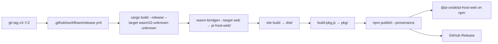

# Release process

How `@pi-oxide/pi-host-web` is built, published, and made reproducible.

## TL;DR for maintainers

```bash
# 1. Bump version in pi-host-web/package.json
# 2. Update CHANGELOG.md
# 3. Commit, tag, push:
git commit -am "release vX.Y.Z"
git tag vX.Y.Z
git push origin main vX.Y.Z
# 4. The Release workflow builds WASM + SDK, verifies tag↔version, publishes to npm with provenance, and opens a GitHub Release.
```

The workflow fails loudly if:
- Tag version ≠ `pi-host-web/package.json` version
- The package is not linked to this repo on npm (provenance requirement)
- Rust tests, the WASM build, or the SDK build fail

## Architecture



## Three-layer output

`@pi-oxide/pi-host-web` ships three import surfaces, each rebuilt from source per release:

| Layer | Import | Origin |
|---|---|---|
| Raw WASM | `@pi-oxide/pi-host-web/raw` | `wasm-bindgen --target web` → `pi_host_web.js` + `pi_host_web_bg.wasm` |
| Bindings | `@pi-oxide/pi-host-web/bindings` | vite build of `sdk/bindings/` |
| SDK | `@pi-oxide/pi-host-web` | vite build of `sdk/` |

The release workflow regenerates the raw WASM bindings (`pi_host_web.js`, `pi_host_web_bg.wasm`, `*.d.ts`) from the Rust source. These are gitignored at `pi-host-web/` and **must not be committed** — the published tarball carries them.

## Provenance (OIDC, no npm token)

Publishing uses npm provenance via GitHub OIDC. There is **no long-lived `NPM_TOKEN` secret**. Instead, GitHub Actions mints a per-job OIDC token (`id-token: write` permission), and npm verifies it against the package's configured publishing access. The published tarball carries a signed provenance statement.

### One-time npm-side setup (owner only)

1. Sign in at npmjs.com → open the `@pi-oxide/pi-host-web` package page.
2. **Settings** → **Publishing access**.
3. Connect the GitHub repository `Irvingouj/pi-oxide`.
4. (Recommended) enable **Require provenance**.

Until this link exists, `npm publish --provenance` fails with `provenance generation is disabled`.

## Version-source contract

The tag version MUST equal `pi-host-web/package.json#version`. The `pkg/package.json` is produced by `build-pkg.js` and is gitignored — never edit it directly.

The `wasm-bindgen-cli` version is matched to the locked `wasm-bindgen` crate version by reading `Cargo.lock` at build time, avoiding the classic "wasm-bindgen version does not match" error.

## Reproducing a release locally

```bash
# Build raw WASM bindings
cargo build --release --target wasm32-unknown-unknown
wasm-bindgen --target web --out-dir pi-host-web target/wasm32-unknown-unknown/release/pi_host_web.wasm

# Build SDK + pkg/
cd pi-host-web && npm ci && npm run build && node scripts/build-pkg.js
cd pkg && npm publish --dry-run
```
